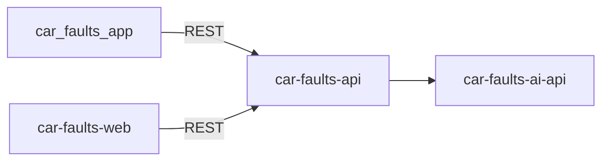

<p align="center">
  
</p>

# Car Faults App

Mobile client for **Auto Crónica** - a SaaS focused on **chronic reliability by vehicle model**: what typically fails on a given make / model / year / engine, how severe it is, typical cost and how it gets fixed.

Initial market: **Portugal** (later ES/FR). Product languages: `pt-PT`, `en-GB` and `es-ES`.

## What we are

The Flutter mobile app (Android / iOS) that consumes [`car-faults-api`](../car-faults-api) (Nest backend) and renders known-issue lookups, reviews, and fixes for buyers and owners. There is no mock backend - product features will call the Nest API, never a local fake.

## What we are not

We do **not** call the AI service directly, provide VIN history, odometer fraud checks, or accident records for a specific vehicle (that problem space belongs to services like carVertical / Certidão / IPO). All AI-generated content is fetched through the Nest API, never from [`car-faults-ai-api`](../car-faults-ai-api). This is not the Next.js frontend - that is [`car-faults-web`](../car-faults-web).

## Problem we solve

Known-issue information is fragmented across forums, YouTube, ADAC/TÜV reports, and Facebook groups. Buyers and used-car owners often discover chronic faults too late. This app gives them one place to look up a model before they buy, on a phone.

## Stack

| Layer | Technology |
|-------|------------|
| Framework | Flutter (Dart `^3.13`) |
| UI | Material 3 |
| Lint | [flutter_lints](https://pub.dev/packages/flutter_lints) |
| Tests | `flutter_test` |
| CI | GitHub Actions (`.github/workflows/ci.yml`) |
| Backend | [car-faults-api](../car-faults-api) (Nest) - never calls AI directly |

## Current status

The UI is still the Flutter starter (counter demo in `lib/main.dart`). Product features are not implemented yet. `lib/` has no `data/`, `domain/`, or `ui/` feature folders.

## MVP / What this app will do

1. Lookup by make, model, year, and engine (delegated to `car-faults-api`)
2. Display `known_issues` + `tech_specs` for a vehicle
3. Google login (via the API)
4. Reviews and comments on issues
5. Fixes: a curated catalog per known issue that users can upvote/downvote - not user-submitted
6. Garage: signed-in user's saved vehicles + known issues

AI content is marked as generated, and product copy should treat results as indicative - not a substitute for a mechanic.

## How it fits



This app never talks to `car-faults-ai-api` directly - all AI-derived content flows through the Nest API. [`car-faults-web`](../car-faults-web) is the other user-facing client.

## Project structure

Intended layout (UI by feature, data/domain by type). Today only `lib/main.dart` exists.

```
lib/
  data/
    models/          # API models
    repositories/    # Repository implementations
    services/        # HTTP client and local storage wrappers
  domain/
    models/          # Clean domain models
    use_cases/       # Optional business logic
  ui/
    core/            # Shared widgets, theme, typography
    features/
      [feature]/
        view_models/
        views/
```

## Getting started

Requires the [Flutter SDK](https://docs.flutter.dev/get-started/install) matching `sdk: ^3.13.0` in `pubspec.yaml`.

```bash
flutter pub get
cp env/dev.example.json env/dev.json   # first time only — fill in your values
flutter run --dart-define-from-file=env/dev.json
```

Local config lives in `env/dev.json` (gitignored). Copy `env/dev.example.json` and set:

| Key | Value |
|-----|-------|
| `API_BASE_URL` | Your PC's LAN IP + API port (e.g. `http://192.168.1.207:3005` on a physical phone; use `http://10.0.2.2:3005` on the Android emulator) |
| `GOOGLE_SERVER_CLIENT_ID` | Same as `GOOGLE_CLIENT_ID` in `car-faults-api/.env` |

VS Code / Cursor: use the **car_faults_app (dev)** launch configuration (`.vscode/launch.json`).

Agent skills are optional: they're defined in `skills-lock.json` and installed into `.agents/` (gitignored) via `npx skills update`, not required to run or build the app.

### Useful URLs

| Resource | URL |
|----------|-----|
| API (default local port, see `car-faults-api/.env.example`) | `http://localhost:3001` |

### Development workflow

Before committing or opening a pull request, always run:

```bash
flutter analyze              # static analysis + lints
flutter test --coverage      # widget / unit tests + lcov report
dart run tool/check_coverage.dart  # fail below 90% line coverage
```

Pull requests and pushes to `main` run the same checks in GitHub Actions (`.github/workflows/ci.yml`): `lint` (`dart format` + `flutter analyze`) and `test` (`flutter test --coverage` + the 90% gate). Merge stays blocked only if those jobs are required status checks on `main`.

## Tests

```bash
flutter analyze
flutter test --coverage
dart run tool/check_coverage.dart
```

Line coverage must stay at **90%+** (`coverage/lcov.info`). The suite currently has the Flutter starter smoke test in `test/widget_test.dart` and coverage-gate unit tests in `test/coverage_gate_test.dart`.

## License

Proprietary - All Rights Reserved (Daniel Fonseca da Silva). See [LICENSE](LICENSE).
Use and run allowed; modification and derivative works require written permission.

You may use and run this software. You may **not** modify it or create derivative works without prior written permission from the copyright holder.
